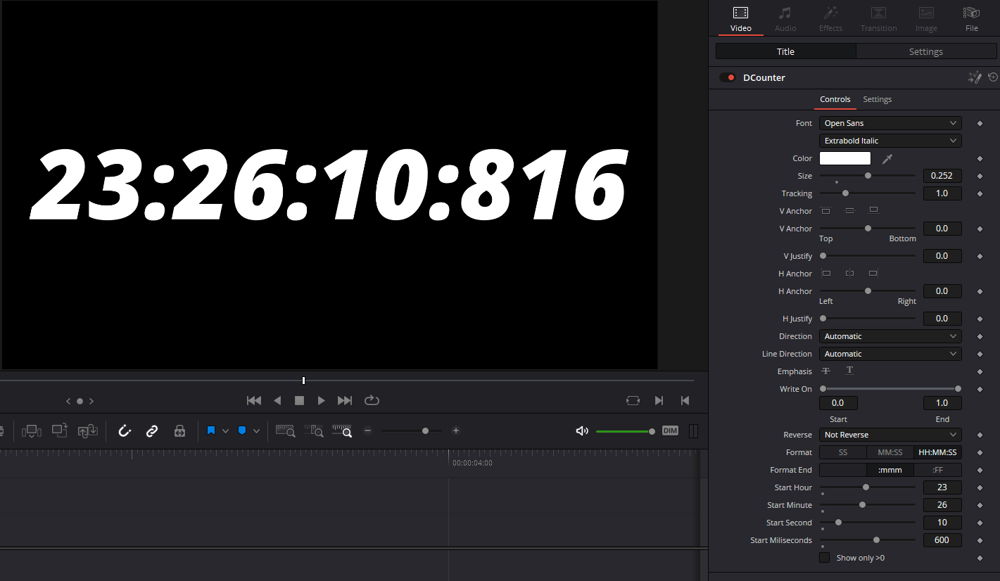

# Davinci Resolve Plugins

All plugins are available for free, and unlocked - means you can directly edit the effect/generator inside fusion.

## Counter

{ align=right style="height:240px"}
Basic counter with milliseconds/frames and offset.
Supported formats:

- 00:00:00.000 (HH:MM:SS:ms)
- 00:00:00:00 (HH:MM:SS:ff)
- 00:00:00 (HH:MM:SS)
- 00:00 (MM:SS)
- 00 (SS)

Additionally, you can set the start offset, framerate will be automatically detected (CompFramerate), and it can strip leading zeros.
For more Advanced Text+ options, just open it in fusion, and edit the text+ node.

Core logic is written in LUA (Text+ Textfield expression)

[DCounter.drfx](plugins/DCounter.drfx)

## WIP

More plugins will be added soon :tm:.