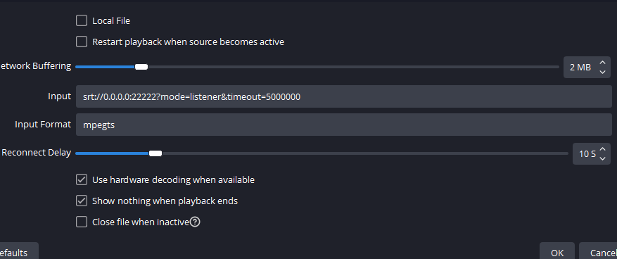

# IRL streaming (OBS)

---

IRL - In REAL Life streaming has some difficulties. You have limited processing power, limited upload speed and limited battery life. Probably also an mobile data cap as well as signal loss.
How can you stream from your phone without having to worry about all that stuff? (at least not as much)

## Viewer experience

The worst that can happen to your broadcast is a complete disconnect. The viewer will see a black screen and will probably leave. So we need to make sure that this doesn't happen. We can archive this for example via a stationary PC at home, that is always on and has a stable upload speed (10MiB/s). We just have to somehow get the video from our phone to the PC. This is where SRT comes in.

SRT is a protocol specifically designed for low latency video streaming. It can handle packet loss and retransmit lost packets. It also has a built in encryption and authentication. It is also open source and free to use.

!!! note
    RTMP is the protocol used by twitch, youtube etc. It is not designed for packet loss. Thats the reason why streaming directly to twitch/youtube from your phone is not a good idea. It probably works in very good conditions, but you can't rely on that. Especially on conventions where the internet is overloaded and the signal is bad.

## Required Hardware

- A phone with a (good) camera, build in mic, or external mic(aux/bluetooth). (USB cams are experimental on Android, speaking of DLSR + Camlink or simliar)
- A stationary PC at home with enough upload and download speed to stream. (any semi modern laptop will do probably)
- A bit of time to set it up.

## Lets get started

1. Download OBS for your PC install it, set it up for streaming to your favorite platform.
2. Install the Websocket plugin for OBS. (Newer versions of OBS have it built in)

      Configure a password/user as well as a random port (everything in the 4 and 5 digits should be free).

3. Add a media source to your scene (name it whatever you want)

      Input following URL: `srt://0.0.0.0:PORT?mode=listener&timeout=5000000`

      I've used Port 22222 in this example
      

4. Download "Larix Broadcaster" for your phone.
5. Add a new server in the settings under connections.

   - Name can be anything, URL hast to be srt://IPOFYOURPC:PORT (PORT=22222 in this example)

   - Delay can be lower than 2000ms, but mobile networks aren't that reliable, so I'd recommend 2000ms.

6. Adjust the video settings to your liking

   - 1080p 30fps is good for IRL, variable bitrate of 3000kb/s, (Format HEVC if available)

   - Way at the bottom of the video settings you can enable "Adaptive bitrate streaming" and set it to "Ladder ascend"

      This will automatically lower your video bitrate if your connection is bad, to still allow retransfering lost packets. The Bitrate will go up again as soon as the available bandwidth increases.

7. Setup up mic settings to your liking

8. Go back to the main screen and press the "Shutter" button to start streaming.

      After a few seconds the video feed should be visible in your OBS with ~2seconds delay.

## Making it work from outside your home

1. Setup port forwarding on your router to forward the port you've chosen above to your PC running OBS.
2. Also make the port open for your OBS websocket (You can use for example OBS Blade on your phone to control OBS remotely, to start/stop streaming, change scenes etc.)

!!! Danger

    OPENING PORTS IS A POTENTIAL SECURITY RISK, MAKE SURE YOU KNOW WHAT YOU ARE DOING AND THAT YOU HAVE A SECURE PASSWORD FOR YOUR WEBSOCKET. ONLY LEAVE IT OPEN AS LONG AS YOU NEED IT. DON'T TELL ANYONE THE PORT NUMBERS, JUST TO BE SAFE. ANYONE WITH THE PORT AND PASSWORD OF YOUR WEBSOCKET CAN START STREAMING. YOU HAVE BEEN WARNED.

1. Setup a Dynamic DNS service, so you have a static URL to connect to.
   1. I use noip.com - its free and easy to use.
   2. Create an account, add a new Domain and follow the instructions.
   3. Download the client and install it on your PC. (You can also set up the service on your router if its supported)
   4. Select your configured domain in the client

      Now the Dynamic DNS service Domain should always resolve in your public home address

2. Adjust the IP in your Larix Broadcaster APP (Server settings) to your created DOMAIN.

All done, you should now be able to stream from anywhere in the world.

## Cool stuff

- auto scene switcher, on bad internet / connection loss / ending / starting etc: [Loopy SRT Stats Monitor](https://github.com/loopy750/SRT-Stats-Monitor)
  - Just watch his tutorial its fairly easy to follow
- you can minimize the Larix app to open a chat app on the same device (on android you can multi window the apps or use a floating window app)

??? note
    To still read the chat, you can create an overlay inside the Larix app, and set it to preview only. As url use the direct one from twitch popout chat, or JChat. Additionally you have to enable stream and record mirrored video for the selfie cam, so it doesn't flip the overlay. (thats an bug???)
    On android you can enable "keep streaming in background" in the settings, so you can use even another chat app or whatever, sorry iphone users.

## Pros of this setup instead of streaming directly from your phone

- your phone has only to encode your camera and audio, not all overlays etc -> longer battery life
- you can just use all your existing overlays (setup in OBS)
- If your phone disconnects for longer than 2 seconds, the stream keeps running (with loopy you can automatically switch to a different scene, till you reconnected) - chat can meme in the meantime you reconnect and hopefully nobody leaves

Only contra: your pc has to be on during that time.

> -> Enjoy streaming from where ever you are without worring about disconnects etc

Want to know more coll stuff related? [https://obsproject.com/wiki/Streaming-With-SRT-Or-RIST-Protocols](https://obsproject.com/wiki/Streaming-With-SRT-Or-RIST-Protocols)
