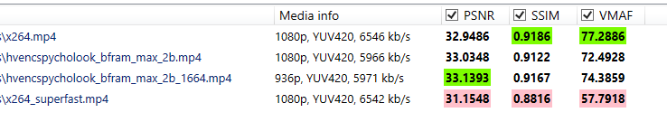
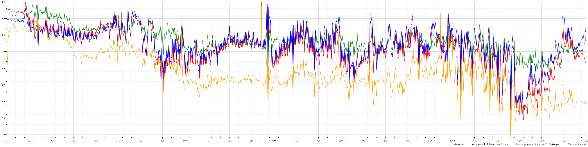
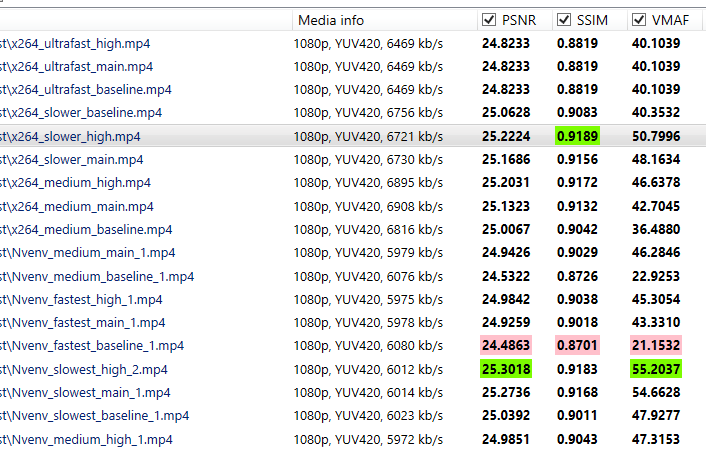
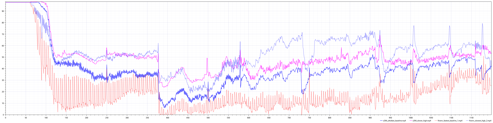

# OBS - encoding comparison

---

If you found that page, its more or less clear that you already know about OBS and the basics (Otherwise there are plenty of great tutorials out there). I'Ve tested all following with version 28.0.3 (64bit) but since those are encoder settings, they should work with any version.

## Best settings for Twitch?

Okay first, what does Twitch recommend? [reference](https://stream.twitch.tv/encoding/)

| 1080p60 | NVENC         | x264                |
| ------- | ------------- | ------------------- |
| Bitrare | cbr 6000 kbps | cbr 6000 kbps       |
| preset: | Quality       | veryfast <-> medium |
| Profile | NaN           | Main/High           |

\*Nvenc = NVIDIA accelerated encoding on GPU | x264 = software encoding (CPU)

It's 2022 so im not gonna really bother testing lower resolutions, but it should mostly match the upcoming outcome.

## Testing method

Since the image quality is pretty close and we as humans cant watch to videos simultaneously, I'm relying on software to compare the encoders with different settings.

As Software tool I came across [VMAF](https://github.com/Netflix/vmaf) (Video Multimethod Assessment Fusion), made by Netflix. It tries to measure the perceptual video quality by comparing it to a reference video. The maintainers of the GitHub repo were kind and linked a functional GUI by fifonik called [FFMetrics](https://github.com/Netflix/vmaf).

\*before using FFMetrics you have to install ffmpeg and add it to your Path
\*\*I've used 1.3.1 beta 2 for this test.

1. ### We need a reference video

    This video should has a ~much higher bitrate than the target bitrate. For us the target is 6kb/s, 20kb/s should be fine, my test video had vbr_50kb/s+. Additionally my video was 4k but that doesnt matter for the test. (Also downscaled it to 1080p with 70kb/s_vbr to test against, same result)

2. ### Encode the videos

    Im using Adobe MediaEncoder (2022) for this, with the [voukoder](https://www.voukoder.org/forum/thread/783-downloads-instructions/) plugin. Any other software with NVENC support should work as well. (Handbrake, or bare bones ffmpeg works)

    Encoder set to CBR 6kb/s presets visible in name.  
    Note: X264 tries to break out of the 6kb/s limit (not sure why, 7kb/s would be still fine for twitch, and in real world bitrate will vary a bit anyway), just to keep a little in mind when comparing the results.

    To optimize NVENC I've used following:

    > b=6000000 b_adapt=1 bf=2 nonref_p=1 preset=p7 profile=high rc=cbr spatial-aq=1 temporal-aq=1

??? info "voukoder/ffmpeg settings mapped to obs"
    b = bitrate | b_adapt = Look-ahead | bf = Max B-frames | preset = p7 equals"Max quality" | profile = profile | rc = rate control | spatial-aq and temporal-aq = are both under "Psycho Visual Tuning"

\*kb/s are average over the whole 20 seconds

## Results

Why did I "optimize"/ took extra steps for NVENC? well look without and with:

Software x264 is better in such difficult scenarios with limited bitrate:

But there is still a big downside to Software x264, it's running completely on the CPU.  
My highest used setting was "slower" (there ist still very slow and placebo), but slower was already the point where the CPU was at 100% usage, so realtime rendering without hiccups is not possible, playing a game next to it is not possible.  
My CPU is a Ryzen 5 3600 on 4.2ghz, but even with more cores its not really justifiable to use x264 for streaming, except for a dual system configuration.

### Alright, Whats the real world difference? (gaming)

For that comparison I recorded a 20 second clip of Apex walking, spinning the camera like an idiot and shooting like in a fight. (Source record was cbr_20kb/s, 1080p, 60fps)

We can see that the NVENC encoder falls a bit short during high motion scenes, but considered that the x264 is only realtime while maxing out all 12 threads of my CPU, NVENC is still the winner. Quality during walking, sliding, looking around is pretty much the same. Between frame 1130 and 1200 the NVENC encoder really fucks up compared to x264, but actually to a human it looks more or less the same (the crazy cam spinning).
With x264 profile set to superfast (so I could actually stream and game, next to it) the quality is even worse (yellow line) and gets easily outperformed by NVENC.

## Technical results

Additionally avoid the faster presets, because they vary from frame to frame with their quality, as seen in the following graph. Im guessing, the spikes are the B-Frames and the intermediate frames are with a lower quality.

## Hold up - there is AV1 coming????

Yes, but you can completely forget software encoding - for the same quality of x264 you need at least 5 times the render time. Intel Arc and the GeForce 4000 and probably upwards cards support AV1 hardware encoding, but none of the streaming providers support it yet. There is barely support for decoding (RTX 3000 supports its).

## And What about the framerate?

Good thought, I thought about that too, like 6kb/s on 48fps or even 30 - 30, that should be doubled the quality with the same bitrate, right? Nope, not at all. I've run test with different framerates (60 high bitrate to 60 with 6kb/s, to 48 and to 30). The results were pretty much the same, almost negligible difference in the real world.
Speaking of maybe max 1% difference, but that is not really noticeable, plus with 48fps, if you want to record/ download your VOD and cut it, upload it to youtube, you will probably use 60, so frameinterpolation - and thats not worth it. Simply stick with 60fps.

## Conclusion

NVENC is the way to go, if you have a NVidia GPU. AMD has a similar feature called AMF (i think its called?), but I've never tested it myself, should perform about the same. Not sure if the extra options (Psycho Visual Tuning and Look-ahead) are available for AMD, but there is probably something similar.  
If you have the spare cpu power (meaning probably a second pc or 12cores+), its worth a consideration to squeeze out a little more quality, but simply said, go with GPU accelerated encoding.
