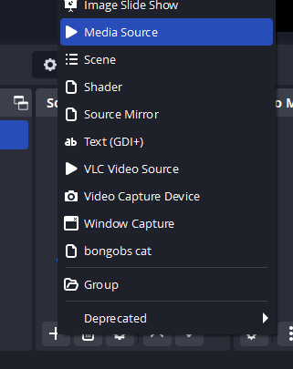

# OBS - IRL streaming

---

IRL - In REAL Life streaming has some difficulties. You have limited processing power, limited upload speed and limited battery life. Additionally mobile data caps as well as signal loss.  
This page will try to give you some tips and tricks to get the best out of your setup.

## Required Hardware

- A phone with a (good) camera, in build mic, or external mic(aux/bluetooth). (USB cams are experimental on Android)
- A stationary PC at home with enough upload and download speed to stream. (any semi modern laptop will do probably)
- A bit of time to set it up.

## Lets get started

1. Download OBS for your PC install it, set it up for streaming to your favorite platform.
2. Install the Websocket plugin for OBS.
   1. Configure a password/user as well as a random port (everything in the 4 and 5 digits should be free).
3. Add a media source (name it whatever you want)
   1. 
   2. 
      I've used Port 22222 in this example
4. Download "Larix Broadcaster" for your phone.
   1. Add a new server in the settings under connections.
      1. name can be anything, URL hast to be srt://IPOFYOURPC:PORT (PORT=22222 in this example)
      2. Delay can be lower than 2000ms, but mobile networks aren't that reliable, so I'd recommend 2000ms.
   2. Adjust the video settings to your liking
      1. 1080p 30fps is good for IRL, variable bitrate of 4kb/s, Format HEVC if available)
      2. Setup up mic settings etc
   3. Go back to the main screen and press the "Shutter" button.
      1. After a few seconds the video feed should be visible in your OBS

## Making it work from outside your home

1. Setup port forwarding on your router to forward the port you've chosen above to your PC running OBS.
2. Also make the port open for your OBS websocket (You can use for example OBS Blade on your phone to control OBS remotely)

!!! Danger

   OPENING PORTS IS A POTENTIAL SECURITY RISK, MAKE SURE YOU KNOW WHAT YOU ARE DOING AND THAT YOU HAVE A SECURE PASSWORD FOR YOUR WEBSOCKET. ONLY LEAVE IT OPEN AS LONG AS YOU NEED IT. DON'T TELL ANYONE THE PORT NUMBERS, JUST TO BE SAFE. ANYONE WITH THE PORT AND PASSWORD OF YOUR WEBSOCKET CAN START STREAMING. YOU HAVE BEEN WARNED.**

1. Setup a Dynamic DNS service, so you have a static URL to connect to.
   1. I recommend noip.com - its free and easy to use.
   2. Create an account, add a new Domain and follow the instructions.
   3. Download the client and install it on your PC.
   4. Select your configured domain in the client
      1. Now the Dynamic DNS service Domain should always resolve in your public home address
2. Adjust the IP in your Larix Broadcaster APP to your created DOMAIN.

All done, you should now be able to stream from anywhere in the world.

## Cool stuff

- auto scene switcher by [Loopy SRT Stats Monitor](https://github.com/loopy750/SRT-Stats-Monitor)
  - Just watch his tutorial its fairly easy to follow
- you can minimize the Larix app to open a chat app on the same device (on android you can multi window the apps or use a floating window app)

## Pros of this setup instead of streaming directly from your phone

- your phone has only to encode your camera and audio, not all overlays etc -> longer battery life
- you can just use all your existing overlays
- If your phone disconnects, the stream keeps running (with loopy you can automatically switch to a different scene, till you reconnected)

Only contra: your pc has to be on during that time.

> -> Enjoy streaming from where ever you are without worring about disconnects etc

Want to know more coll stuff related? [https://obsproject.com/wiki/Streaming-With-SRT-Or-RIST-Protocols](https://obsproject.com/wiki/Streaming-With-SRT-Or-RIST-Protocols)
