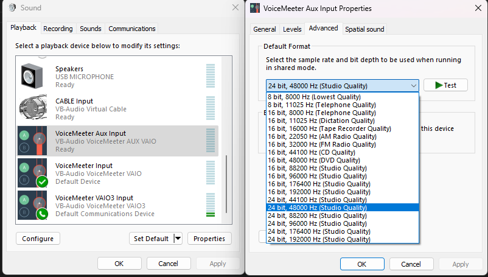
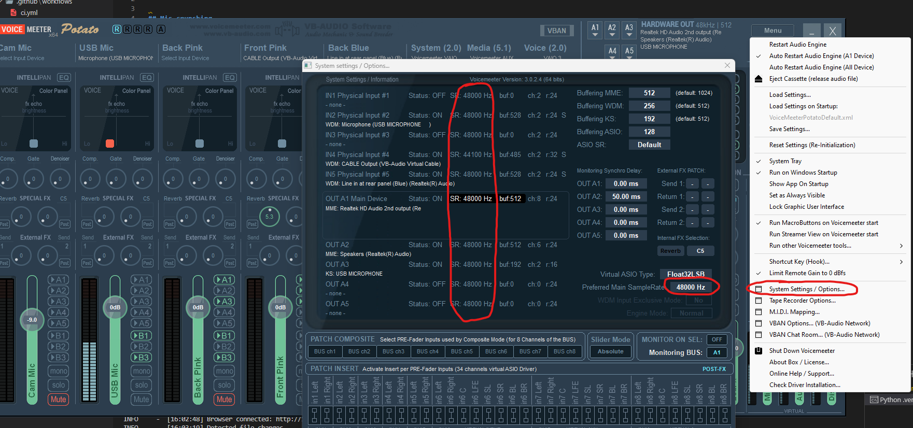

# Mic crunshing / crackling

Open the sound settings and set all your devices which connect to VoiceMeeter to 48khz.

1. `win+r` a window should pop out on the bottom left
2. enter `control mmsys.cpl sounds` and click OK or press enter

Inside Voicemeeter set the Engine to 48khz as well.

As a last step, restart the Voicemeeter Engine (Menu -> First item)